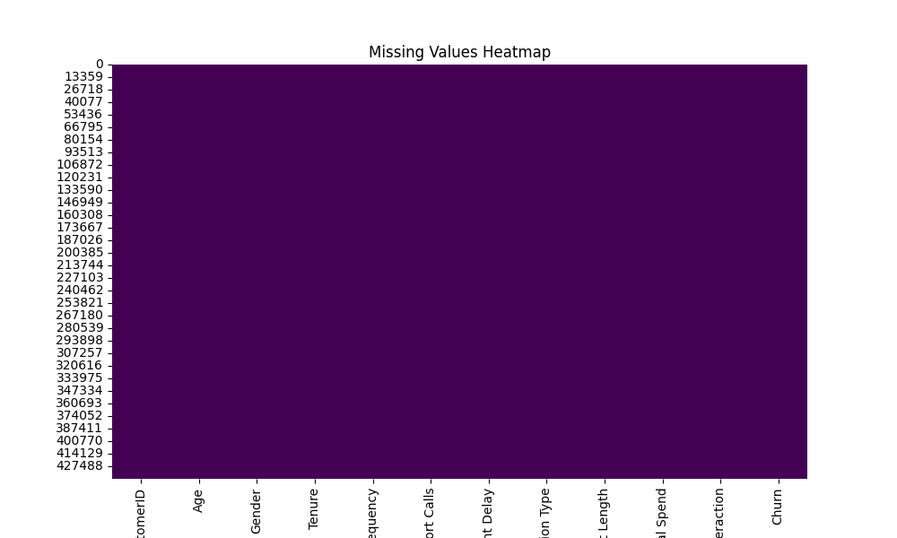
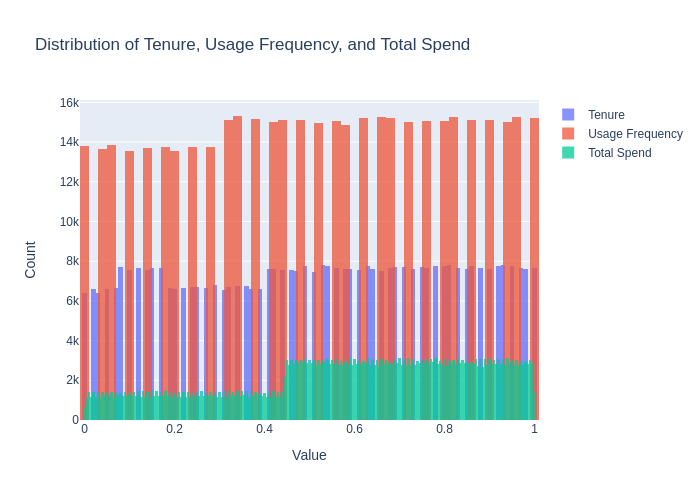
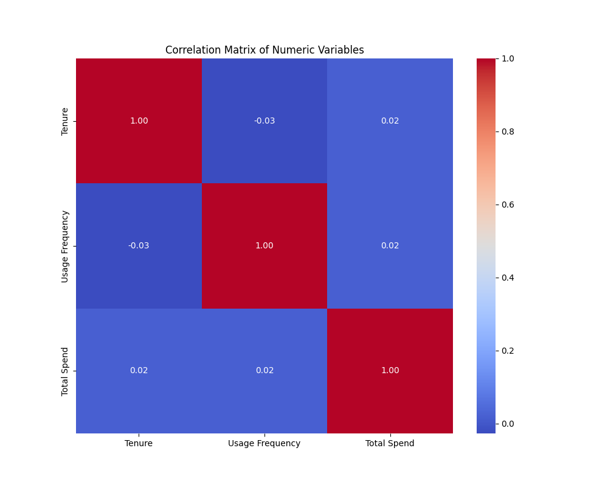
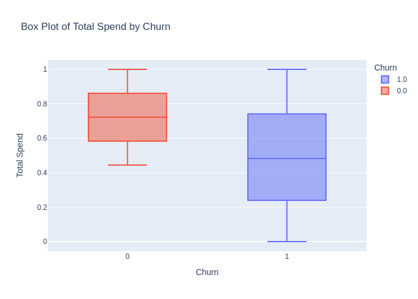
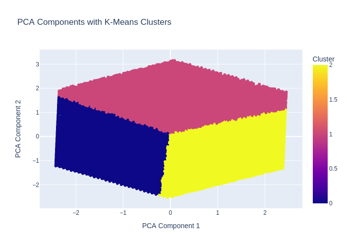

# Customer Churn Exploratory Data Analysis (EDA)

## Introduction

This report presents the findings from the Exploratory Data Analysis (EDA) conducted on the customer churn dataset. The goal is to identify patterns, understand the distribution of key variables, and explore factors associated with customer churn.

## Data Overview

The dataset includes the following features:
- `CustomerID`
- `Age`
- `Gender`
- `Tenure`
- `Usage Frequency`
- `Support Calls`
- `Payment Delay`
- `Subscription Type`
- `Contract Length`
- `Total Spend`
- `Last Interaction`
- `Churn`

## Data Preprocessing

1. **Handling Missing Values**:
   - A heatmap was generated to visualize missing values across the dataset.

   
2. **Normalization**:
   - Numerical features (`Tenure`, `Usage Frequency`, `Total Spend`) were normalized to bring them on a common scale.

## Exploratory Analysis

### 1. Distribution of Numerical Features

**Histograms**:
Histograms were plotted for the numerical features to understand their distributions:
- `Tenure`
- `Usage Frequency`
- `Total Spend`

### 2. Correlation Analysis

**Correlation Matrix**:
The correlation matrix was computed to analyze the relationships between numerical features. The matrix shows the strength of the linear relationship between features.

### 3. Patterns and Relationships

**Scatter Plot**:
A scatter plot was created to visualize the relationship between `Tenure` and `Usage Frequency`, colored by `Churn` status.

**Box Plots**:
Box plots were generated to compare the distribution of `Usage Frequency` and `Total Spend` with `Churn` status:
- `Usage Frequency` by `Churn`
- `Total Spend` by `Churn`

### 4. PCA and Clustering

**PCA Components with K-Means Clusters**:
PCA was applied for dimensionality reduction, followed by K-Means clustering to identify distinct clusters within the data.

## Findings

1. **Distribution Insights**:
   - The histograms revealed how `Tenure`, `Usage Frequency`, and `Total Spend` are distributed among the customers.

2. **Correlation Insights**:
   - The correlation matrix showed strong relationships between certain features, which could be relevant for predicting churn.

3. **Churn Patterns**:
   - The scatter plot highlighted how `Tenure` and `Usage Frequency` differ between churned and non-churned customers.
   - The box plots illustrated that churned customers tend to have different `Usage Frequency` and `Total Spend` compared to non-churned customers.
   - The PCA plot showed distinct clusters within the data, providing insights into customer segmentation.

## Conclusion

The EDA provided valuable insights into customer churn. Patterns identified in the analysis can help in understanding the factors that contribute to churn and guide further actions to retain customers.

For predictive modeling and more in-depth analysis, additional steps such as feature engineering and machine learning modeling are recommended.
